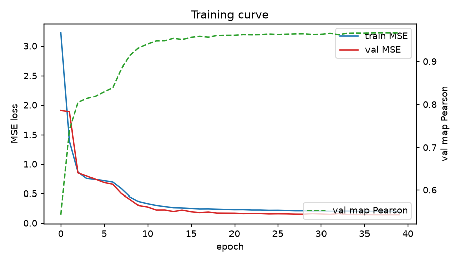
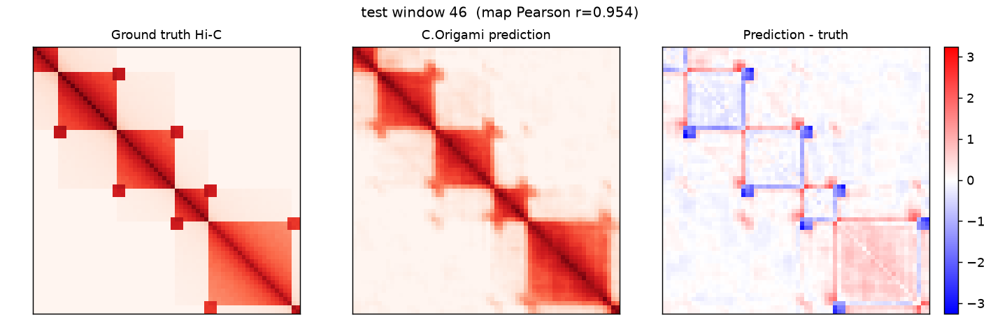
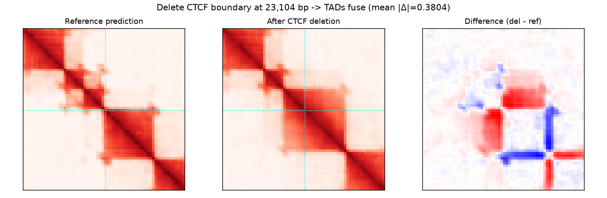
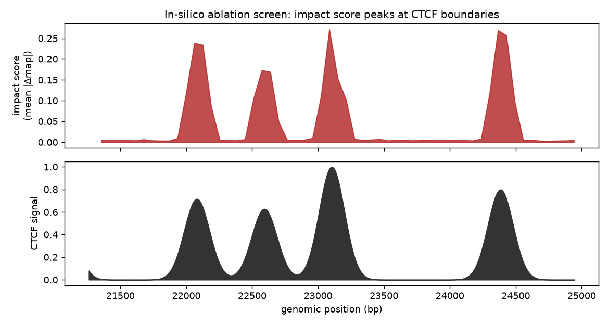
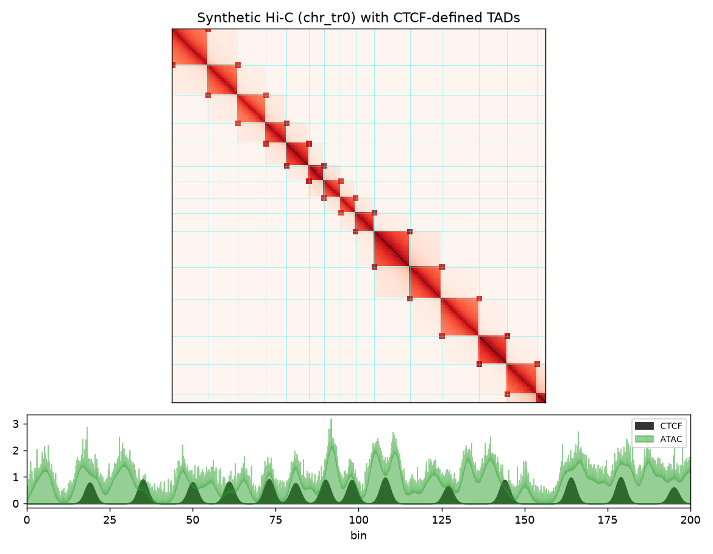

# C.Origami reproduction

A faithful, runnable reproduction of **C.Origami** (Tan et al., "Cell-type-specific
prediction of 3D chromatin organization enables high-throughput in silico genetic
screening", *Nature Biotechnology* 2023, [doi:10.1038/s41587-022-01612-8](https://doi.org/10.1038/s41587-022-01612-8);
official code [tanjimin/C.Origami](https://github.com/tanjimin/C.Origami)).

C.Origami predicts a **cell-type-specific Hi-C contact map** (256×256, over a
2,097,152 bp window at 10 kb resolution) from three genomic tracks aligned to the
same window — **DNA sequence**, **CTCF ChIP-seq**, and **ATAC-seq** — and can then
perform *in-silico* genetic perturbation to dissect which elements drive 3D genome
organization.

This repo reimplements the model architecture, data pipeline, training recipe,
evaluation metrics, and all three inference tasks (prediction, deletion,
screening), and verifies them **end-to-end** on a biologically-motivated synthetic
genome — including reproducing the paper's headline causal finding that deleting a
CTCF-bound TAD boundary fuses adjacent TADs.

## Why synthetic data

The published model trains on multi-GB IMR-90 genomic data for GPU-days. This
environment has no GPU (4 CPUs, 15 GB RAM), so training on the real data is not
possible here. Instead the *method* is exercised faithfully on a **synthetic
genome** in which CTCF sites define TAD boundaries and convergent CTCF pairs define
corner loops, and Hi-C is generated from distance-decay × boundary-insulation ×
loops. This makes CTCF *causal* for TAD structure — exactly the relationship
C.Origami learns and that in-silico deletion probes — so the full pipeline and the
paper's key result can be demonstrated on CPU. The architecture is identical to the
paper's; only the data source differs.

## What was reproduced

| Component | File | Notes |
|---|---|---|
| Origami model (`ConvTransModel`) | `corigami_repro/model.py` | EncoderSplit (2× 1D-CNN towers, 12 ResBlocks) → 8-layer pre-LN Transformer → outer-concatenation → 5-block dilated 2D decoder. Matches `blocks.py`/`corigami_models.py`. |
| Data pipeline | `corigami_repro/data.py` | one-hot DNA + CTCF/ATAC tracks as input; Hi-C sub-matrix resized to `map_size` + log1p as target; shift / gaussian-noise / reverse-complement augmentation. Synthetic genome generator. |
| Training | `corigami_repro/train.py` | Adam (2e-4, wd 0), grad-clip 1.0, linear-warmup + cosine anneal, MSE loss — the paper's recipe in plain PyTorch. |
| Metrics | `corigami_repro/metrics.py` | insulation score, per-map Pearson, insulation Pearson, observed-vs-expected, distance-stratified correlation. |
| Inference | `corigami_repro/inference.py` | prediction; in-silico deletion (`editing`); feature ablation; screening with impact score. |

The paper's exact configuration is the module default (`PAPER_CONFIG`:
`num_blocks=12`, 2,097,152 bp window, 256×256 map, 12.84 M params). Because the 2D
decoder over `map_size²` dominates compute, `map_size` / channel widths /
`num_blocks` are exposed so the identical architecture can run on CPU
(`DEMO_CONFIG`: 64×64 map, 1.17 M params) — this is what the end-to-end scripts use.

## Results (DEMO_CONFIG, 40 epochs, ~17 min on 4 CPUs)

Held-out **test chromosome**, model vs. a mean-map (distance-decay-only) baseline:

| metric | model | mean-map baseline |
|---|---|---|
| map Pearson | **0.967** | 0.846 |
| insulation-score Pearson | **0.974** | 0.314 |
| observed-vs-expected Pearson | **0.880** | ~0 |
| MSE | **0.147** | 0.626 |

Observed-vs-expected (correlation after removing the shared distance-decay
"expected" map) is the metric that matters: it measures whether the model captures
**window-specific** TAD structure rather than just the average. At 0.88 it clearly
does — the mean-map baseline is ~0 there by construction.




### In-silico perturbation — the paper's headline result

**Deleting a CTCF boundary fuses adjacent TADs.** The reference prediction shows two
separated TADs; after deleting the boundary CTCF site the two TADs merge, with the
difference map showing new cross-boundary contacts (red) and lost insulation (blue):



**Screening recovers boundaries de novo.** Sliding a feature ablation across a
region, the impact score `mean(|Δ contact map|)` peaks precisely at CTCF sites
(impact-vs-CTCF r = 0.93; top peak 19 bp from a true boundary). Ablating a boundary
has **60× more impact** than ablating a control non-boundary region:



The synthetic genome used for training (TAD blocks, corner loops, CTCF/ATAC tracks):



## Running it

```bash
uv venv --python 3.11 .venv && source .venv/bin/activate
uv pip install torch numpy scipy scikit-image matplotlib tqdm
export PYTHONPATH=$PWD

python scripts/run_training.py --epochs 40      # train + evaluate (demo config, CPU)
python scripts/run_perturbation.py              # deletion + screening demos

python scripts/run_training.py --paper          # paper config (2Mb window; needs a GPU)
python -m pytest tests/                          # fast smoke tests (no training)
```

Outputs (figures, metrics JSON, checkpoint) are written to `outputs/`.

## Layout

```
corigami-reproduction/
├── corigami_repro/          # the package
│   ├── model.py             # Origami ConvTransModel (faithful reimplementation)
│   ├── data.py              # synthetic genome + dataset + augmentation
│   ├── train.py             # training loop (paper recipe, plain PyTorch)
│   ├── metrics.py           # insulation score + correlation metrics
│   ├── inference.py         # prediction / deletion / ablation / screening
│   └── plotting.py          # contact-map, deletion, screen figures
├── scripts/
│   ├── run_training.py      # end-to-end: build data, train, evaluate
│   └── run_perturbation.py  # in-silico deletion + screening demo
├── tests/test_pipeline.py   # shape/behaviour smoke tests
├── outputs/                 # figures + reports (checkpoint is gitignored, >2MB)
└── notes.md                 # working log incl. the failure mode + fix
```

## Caveats / honest scope

- **Synthetic, not real, data.** Absolute numbers are not comparable to the paper's
  IMR-90 / GM12878 benchmarks; what is reproduced is the architecture, the training
  method, the metrics, and the qualitative + causal behaviour (TAD prediction,
  boundary-deletion fusion, screening).
- The end-to-end demo uses the reduced `DEMO_CONFIG` for CPU tractability. The
  paper's `PAPER_CONFIG` is the default and builds correctly (verified), but a full
  train needs a GPU.
- Training uses plain PyTorch rather than the official PyTorch-Lightning +
  lightning-bolts stack; the optimisation recipe (optimizer, LR schedule, clipping,
  loss) is matched.
