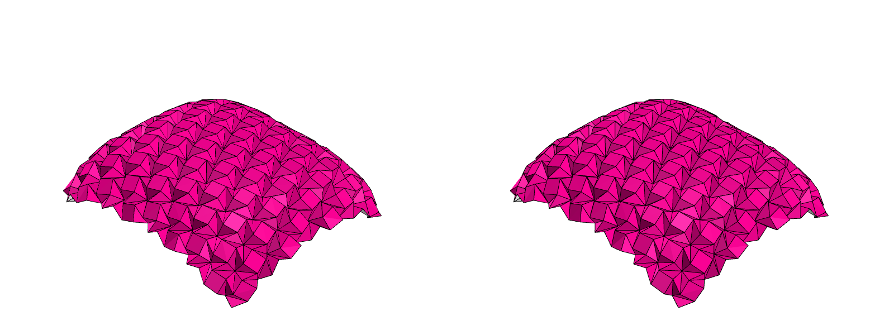

# origami-jax: OrigamiSimulator physics in JAX + rendering in pure NumPy

Reimplementation of the physics-based folding algorithm and the rendering of
[amandaghassaei/OrigamiSimulator](https://github.com/amandaghassaei/OrigamiSimulator)
(MIT licensed), validated against the *actual original app* running headless.

- **Physics**: the GPU compliant-dynamics solver (axial beam springs, crease
  angular springs toward target fold angles, face angle constraints, explicit
  Euler) re-derived from the original's GLSL passes and implemented as a
  vectorized, jitted JAX step (`origami/solver.py`).
- **Rendering**: a pure-NumPy software rasterizer (`origami/render.py`)
  replicating the original three.js (r87) view: same camera, six directional
  lights, flat-shaded Blinn-Phong front/back materials (#ec008b / #dddddd),
  polygon-offset mesh with 1px black crease/boundary lines, and 4x-MSAA
  emulation matching chromium's antialiasing.

## Results

Ground truth comes from driving the original app in headless Chromium
(SwiftShader WebGL) with `extract_groundtruth.js`: it exports the processed
model, deterministic solver trajectories, reference screenshots, and the exact
camera matrices.

### Physics (vs the original GPU solver, same model & parameters)

Max node position error, models spanning a unit bounding sphere (~2 units):

| model | nodes | step 1 | step 100 | step 1000 | speed (jitted, CPU) |
|---|---|---|---|---|---|
| crane (SVG import) | 60 | 3.3e-4 | 2.6e-4 | 5.7e-5 | 80 µs/step |
| huffman waterbomb | 440 | 8.4e-8 | 4.0e-6 | 2.1e-5 | 207 µs/step |
| box-pleat pyramid (standalone FOLD loader) | 2704 | 7.5e-9 | 4.8e-6 | 4.5e-5 | 1.3 ms/step |

The force math is bit-faithful (1e-8-level agreement on clean geometry); the
crane's larger transient comes from float32 cancellation in near-degenerate
crease moment arms produced by that SVG, and it converges to the same
equilibrium. The original steps 100x per frame; the JAX solver does that in
8 ms (crane) on CPU, and the same code jits to GPU/TPU.

### Rendering (vs original WebGL screenshots, same vertex positions)

800x600, per-pixel max channel difference:

| model | exactly identical | within ±2/255 | mean abs diff |
|---|---|---|---|
| crane 0/30/60/90% folded | 97.5 / 97.5 / 98.1 / 99.1 % | 99.4–99.7 % | 0.19–0.35 |
| waterbomb 0/30/60/90% | 92.3 / 93.7 / 95.7 / 97.1 % | 98.1–99.1 % | 0.54–1.25 |
| box pleat 0/30/60/90% | 95.6 / 94.0 / 98.0 / 98.9 % | 97.7–99.5 % | 0.31–1.30 |

Face interiors match exactly (camera, facing, lighting, depth/polygon-offset
logic all agree); every residual difference is isolated single pixels along
1px lines and triangle silhouettes where SwiftShader's exact MSAA/line
rasterization rules differ slightly. End-to-end (JAX-solved positions rendered
with NumPy vs original screenshots) stays ≥99.4% within ±2 on the crane.

Side-by-side (original left, NumPy right), 60% folded:


Fold animation (JAX + NumPy only): `output/crane_fold.gif`, `output/waterbomb_fold.gif`.

## Layout

```
origami-jax/
├── origami/
│   ├── model.py    # model container; load model.json exports or FOLD files
│   │               # (quad split by shorter diagonal, crease params, centering
│   │               #  + bounding-sphere scaling, exactly like the original)
│   ├── solver.py   # JAX solver: step() + jitted simulate(); float32 like the GPU
│   └── render.py   # NumPy rasterizer: three.js r87 camera/Phong/MSAA replication
├── extract_groundtruth.js  # drives the real app headless (playwright-core)
├── compare_physics.py      # trajectory comparison + benchmark
├── compare_render.py       # pixel comparison, writes side-by-side/diff images
├── demo.py                 # end-to-end: fold with JAX, render with NumPy, GIF
├── groundtruth/<model>/    # model.json, trajectory.json, renders.json, *.png
└── output/                 # comparison images, pipeline renders, GIFs
```

## Running

```bash
# physics + benchmark, rendering comparison, end-to-end demo (uses uv)
uv run compare_physics.py groundtruth/crane
uv run compare_render.py groundtruth/crane output
uv run demo.py groundtruth/crane output

# standalone (no browser, no ground truth needed): load a FOLD file directly
uv run python -c "
import numpy as np
from PIL import Image
from origami.model import load_fold
from origami.render import render, visible_line_segments
from origami.solver import fold_to_percent
m = load_fold('path/to/pattern.fold')   # triangles/quads, edges_foldAngle set
s = fold_to_percent(m, 0.6, n_steps=3000)
Image.fromarray(render(np.asarray(s.pos), m.faces,
                visible_line_segments(m.lines))).save('out.png')"

# regenerate ground truth (needs /tmp/OrigamiSimulator clone + playwright chromium)
node extract_groundtruth.js Origami/traditionalCrane.svg groundtruth/crane
```

## Key implementation notes

- The original computes all forces from last positions/velocities (Jacobi
  style, one fragment shader thread per node looping over incident
  beams/creases/faces). The JAX version computes identical per-edge /
  per-crease / per-face forces and scatter-adds them — same math, XLA-friendly.
- `dt = 0.9 / (2π·max√(k_axial/m))`; crease stiffness scales with crease
  length; crease forces use per-step recomputed moment arms (distance of each
  opposite vertex to the crease line) and are disabled when degenerate
  (tolerances 1e-6, matching the shaders).
- Dihedral angles are unwrapped against the previous step (±2π jumps) exactly
  like `thetaCalc`.
- three.js r87 specifics that matter for pixel-equality: legacy
  (non-physically-correct) Blinn-Phong with the π-cancelled Lambert term,
  Schlick fresnel with the exp2 approximation, specular #111111/shininess 30,
  no gamma correction, `polygonOffset(0.5, 1)` on the mesh only, and
  `LessEqual` depth.
- Antialiasing is emulated as 4-sample MSAA: per-sample coverage and depth,
  one shading evaluation per pixel at its center, box resolve. The Vulkan
  standard 4x rotated-grid pattern, y-flipped into image coordinates, matches
  chromium/SwiftShader best.

## Next steps

- Verlet integrator (original supports it; Euler is the default and what's
  validated here).
- Exact SwiftShader line rasterization (diamond-exit + MSAA coverage) to close
  the last fraction of a percent of differing pixels.
- GPU benchmark of the jitted solver on large tessellations.
