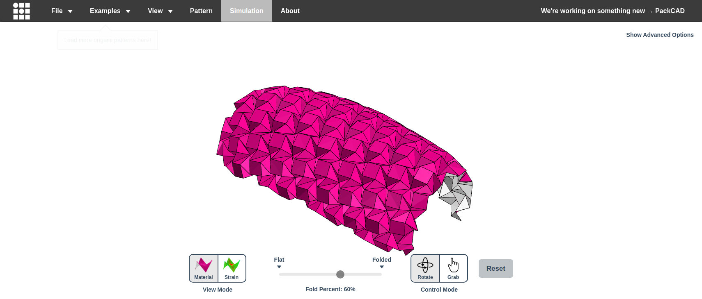
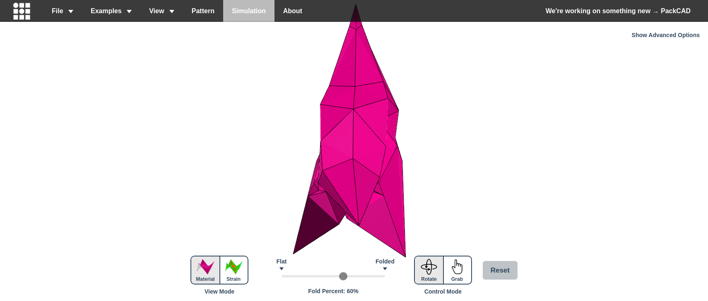
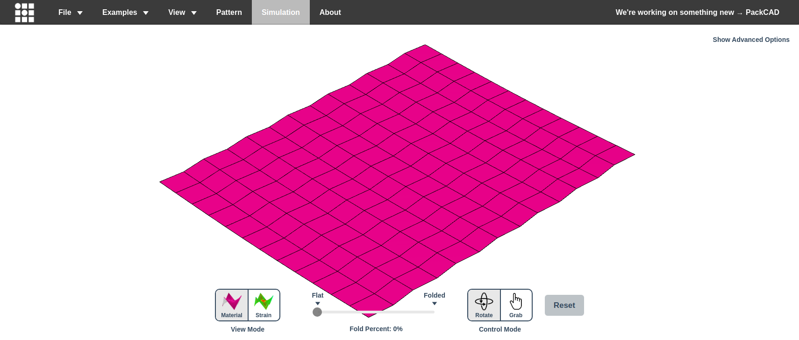
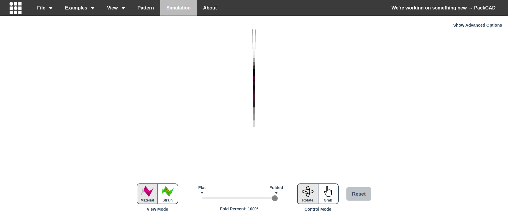
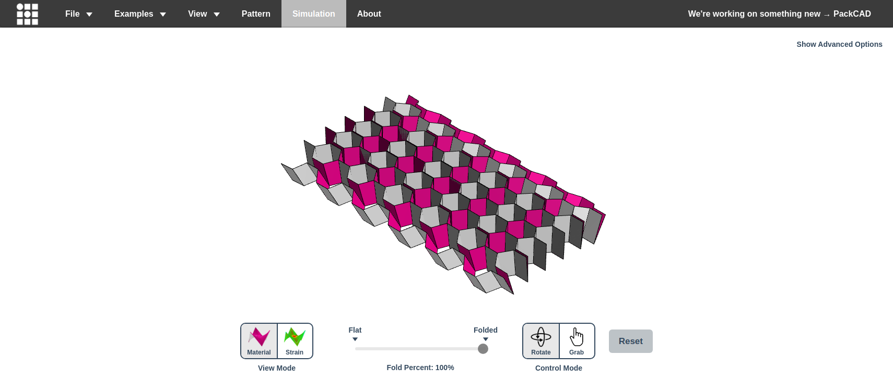
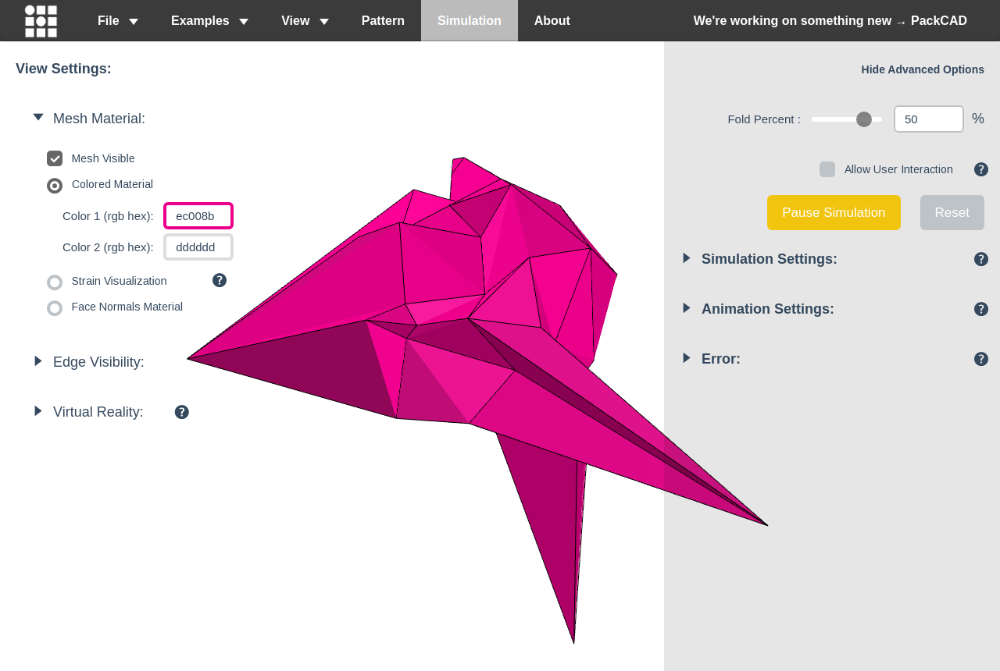

# Exploring Origami Simulator with rodney

*2026-02-25T23:16:23Z by Showboat 0.6.1*
<!-- showboat-id: 996e1217-35d5-49ba-b20b-60c20b0101ac -->

rodney is a headless Chrome automation CLI, installable and runnable via uvx with no prior setup. This document walks through a systematic exploration of https://origamisimulator.org — a WebGL physics-based origami folding simulator — using rodney commands.

## Tool Setup

First, confirm the installed version.

```bash
uvx rodney --version
```

```output
0.4.0
```

```bash
uvx rodney --help
```

```output
rodney - Chrome automation from the command line

Browser lifecycle:
  rodney start [--show] [--insecure | -k]  Launch Chrome (headless by default, --show for visible)
  rodney connect <host:port>      Connect to existing Chrome on remote debug port
  rodney stop                     Shut down Chrome
  rodney status                   Show browser status

Navigation:
  rodney open <url>               Navigate to URL
  rodney back                     Go back in history
  rodney forward                  Go forward in history
  rodney reload [--hard]          Reload page (--hard bypasses cache)
  rodney clear-cache              Clear the browser cache

Page info:
  rodney url                      Print current URL
  rodney title                    Print page title
  rodney html [selector]          Print HTML (page or element)
  rodney text <selector>          Print text content of element
  rodney attr <selector> <name>   Print attribute value
  rodney pdf [file]               Save page as PDF

Interaction:
  rodney js <expression>          Evaluate JavaScript expression
  rodney click <selector>         Click an element
  rodney input <selector> <text>  Type text into an input field
  rodney clear <selector>         Clear an input field
  rodney file <selector> <path|-> Set file on a file input (- for stdin)
  rodney download <sel> [file|-]  Download href/src target (- for stdout)
  rodney select <selector> <val>  Select dropdown option by value
  rodney submit <selector>        Submit a form
  rodney hover <selector>         Hover over an element
  rodney focus <selector>         Focus an element

Waiting:
  rodney wait <selector>          Wait for element to appear
  rodney waitload                 Wait for page load
  rodney waitstable               Wait for DOM to stabilize
  rodney waitidle                 Wait for network idle
  rodney sleep <seconds>          Sleep for N seconds

Screenshots:
  rodney screenshot [-w N] [-h N] [file]  Take page screenshot
  rodney screenshot-el <sel> [f]  Screenshot an element

Tabs:
  rodney pages                    List all pages/tabs
  rodney page <index>             Switch to page by index
  rodney newpage [url]            Open a new page/tab
  rodney closepage [index]        Close a page/tab

Element checks:
  rodney exists <selector>        Check if element exists (exit 1 if not)
  rodney count <selector>         Count matching elements
  rodney visible <selector>       Check if element is visible (exit 1 if not)
  rodney assert <expr> [expected] [-m msg]  Assert JS expression (truthy or equality)

Accessibility:
  rodney ax-tree [--depth N] [--json]       Dump accessibility tree
  rodney ax-find [--name N] [--role R] [--json]  Find accessible nodes
  rodney ax-node <selector> [--json]        Show accessibility info for element

Options:
  --local                         Use directory-scoped session (./.rodney/)
  --global                        Use global session (~/.rodney/)
  --version                       Print version and exit
  --help, -h, help                Show this help message

By default, commands auto-detect: if ./.rodney/state.json exists in the
current directory, the local session is used; otherwise the global session.
Use "rodney start --local" to create a directory-scoped session.

Environment:
  RODNEY_HOME                     Override data directory (default: ~/.rodney)

Exit codes:
  0  Success
  1  Check failed (exists, visible, assert, ax-find returned no match)
  2  Error (bad arguments, no browser, timeout, etc.)
```

## Launching the Browser

rodney manages a persistent Chrome session. `rodney start` launches Chrome in headless mode; subsequent commands connect to it automatically via a state file at `~/.rodney/state.json`.

```bash
uvx rodney start && sleep 2 && uvx rodney status
```

```output
Auth proxy started (PID 15633, port 36584) -> 21.0.0.53:15004
Chrome started (PID 15768)
Debug URL: ws://127.0.0.1:52022/devtools/browser/76c0fa9d-c7c9-4c91-bcde-afcfd58cc33c
Browser running (PID 15768)
Debug URL: ws://127.0.0.1:52022/devtools/browser/76c0fa9d-c7c9-4c91-bcde-afcfd58cc33c
Pages: 0
Active page: 0
```

## Navigating to Origami Simulator

`rodney open` navigates to a URL and returns the page title on success — a built-in confirmation that the page loaded.

```bash
uvx rodney open https://origamisimulator.org
```

```output
Origami Simulator
```

Confirm the URL and title with dedicated commands:

```bash
uvx rodney url && uvx rodney title
```

```output
https://origamisimulator.org/
Origami Simulator
```

Take a screenshot of the default landing state — the simulator loads immediately with a default origami pattern already running at 60% fold:

```bash {image}

```



## Exploring the Page Structure

### Accessibility Tree

`rodney ax-tree` dumps the accessibility tree — useful for understanding a page's structure without reading source HTML, especially for JavaScript-heavy SPAs:

```bash
uvx rodney ax-tree --depth 3
```

```output
[RootWebArea] "Origami Simulator" (focusable, focused)
  [navigation]
    [link] (focusable)
      [image]
    [generic]
      [list]
      [list]
  [generic]
    [Canvas]
  [generic]
    [link] "Show Advanced Options" (focusable)
      [StaticText] "Show Advanced Options"
    [LineBreak] "\n"
      [InlineTextBox]
    [LineBreak] "\n"
      [InlineTextBox]
  [generic]
    [link] "Hide Advanced Options" (focusable)
      [StaticText] "Hide Advanced Options"
    [LineBreak] "\n"
      [InlineTextBox]
    [LineBreak] "\n"
      [InlineTextBox]
    [generic]
      [StaticText] "Fold Percent : "
      [generic]
      [textbox] (focusable, settable)
      [StaticText] "\u00a0\u00a0%"
    [LineBreak] "\n"
      [InlineTextBox]
    [LineBreak] "\n"
      [InlineTextBox]
    [generic]
      [link] "\ue611" (focusable)
      [LabelText]
    [LineBreak] "\n"
      [InlineTextBox]
    [generic]
      [link] "Pause Simulation" (focusable)
      [link] "Reset" (focusable)
    [generic]
      [link] "\ue601 Simulation Settings:" (focusable)
      [link] "\ue611" (focusable)
      [LineBreak] "\n"
      [LineBreak] "\n"
    [generic]
      [link] "\ue601 Animation Settings:" (focusable)
      [link] "\ue611" (focusable)
      [LineBreak] "\n"
    [LineBreak] "\n"
      [InlineTextBox]
    [generic]
      [link] "\ue601 Error:" (focusable)
      [link] "\ue611" (focusable)
      [LineBreak] "\n"
    [LineBreak] "\n"
      [InlineTextBox]
    [generic]
  [generic]
    [generic]
      [generic]
      [StaticText] "View Mode"
    [generic]
      [generic]
      [link] "Flat \ue601" (focusable)
      [link] "Folded \ue601" (focusable)
      [StaticText] "Fold Percent: "
      [generic]
      [StaticText] "%"
    [generic]
      [generic]
      [StaticText] "Control Mode"
    [link] "Reset" (focusable)
      [StaticText] "Reset"
  [generic]
    [StaticText] "View Settings:"
      [InlineTextBox]
    [LineBreak] "\n"
      [InlineTextBox]
    [LineBreak] "\n"
      [InlineTextBox]
    [generic]
      [link] "\ue601 Mesh Material:" (focusable)
    [generic]
      [LabelText]
      [generic]
      [LineBreak] "\n"
    [LineBreak] "\n"
      [InlineTextBox]
    [generic]
      [link] "\ue601 Edge Visibility" (focusable)
      [StaticText] ":"
    [LineBreak] "\n"
      [InlineTextBox]
    [generic]
      [link] "\ue601 Virtual Reality:" (focusable)
      [link] "\ue611" (focusable)
    [LineBreak] "\n"
      [InlineTextBox]
    [generic]
```

### Element Counts

Get a quick structural census of the page using `rodney count`:

```bash

echo 'Nav links:' $(uvx rodney count 'nav a')
echo 'Example links (.demo):' $(uvx rodney count 'a.demo')
echo 'Dropdown menus:' $(uvx rodney count '.dropdown')
echo 'Canvases:' $(uvx rodney count 'canvas')
echo 'Sliders:' $(uvx rodney count '.ui-slider')

```

```output
Nav links: 120
Example links (.demo): 76
Dropdown menus: 3
Canvases: 2
Sliders: 8
```

### Current Fold State

Read the current fold percentage directly from the DOM:

```bash
uvx rodney js "document.querySelector('.foldPercent')?.textContent || document.querySelector('[class*=fold]')?.textContent"
```

```output
null
```

```bash
uvx rodney js "Array.from(document.querySelectorAll('*')).filter(el => el.children.length === 0 && el.textContent.includes('Fold Percent')).map(el => ({tag: el.tagName, cls: el.className, text: el.textContent.trim()}))"
```

```output
[
  {
    "cls": "",
    "tag": "B",
    "text": "Fold Percent"
  },
  {
    "cls": "label-slider",
    "tag": "SPAN",
    "text": "Fold Percent :"
  },
  {
    "cls": "label-slider",
    "tag": "SPAN",
    "text": "Fold Percent :"
  },
  {
    "cls": "",
    "tag": "B",
    "text": "Fold Percent"
  },
  {
    "cls": "displayBlock btn btn-lg btn-default",
    "tag": "A",
    "text": "Configure Fold Percent Animation"
  }
]
```

```bash
uvx rodney js "document.querySelector('.foldAmountDisplay, #foldAmountDisplay, [id*=fold]')?.textContent"
```

```output

            
            Folded
            
        
```

```bash
uvx rodney js "Array.from(document.querySelectorAll('span')).filter(s => /^\d+$/.test(s.textContent.trim())).map(s => ({cls: s.className, id: s.id, val: s.textContent.trim()}))"
```

```output
[
  {
    "cls": "",
    "id": "foldPercentSimple",
    "val": "60"
  }
]
```

The fold percentage lives in `#foldPercentSimple`. Now read it cleanly:

```bash
uvx rodney text '#foldPercentSimple'
```

```output
60
```

## Example Library

### Full Catalogue

The site ships 76 example patterns. Extract them all with their categories using `rodney js`:

```bash
uvx rodney js "Array.from(document.querySelectorAll('a.demo')).map(a => a.textContent.trim())"
```

```output
[
  "Flapping Bird",
  "Randlett Flapping Bird",
  "Crane (3D)",
  "Crane (flat)",
  "Hypar",
  "Hypar (6 point)",
  "Square Twist (single)",
  "Square Twist (many angles)",
  "Mooser's Rigid Train",
  "Paper Airplane",
  "Lang Cardinal",
  "Lang Orchid",
  "Lang KNL Dragon",
  "Miura-Ori",
  "Miura-Ori (sharp angle)",
  "Waterbomb",
  "Whirlpool Spiral",
  "Flower Tower (flat foldable)",
  "Hex/Tri Tessellation (flat foldable)",
  "Huffman Extruded Boxes",
  "Huffman Waterbombs",
  "Huffman Rect Weave",
  "Huffman Stars-Triangles",
  "Huffman Exdented Boxes",
  "Lang Honeycomb Tessellation",
  "Lang Wedged Double Faced Tessellation",
  "Lang Oval Tessellation",
  "Lang Hyperbolic Limit",
  "Resch Triangle Tessellation",
  "Resch Barbell Tessellation",
  "Wavy Pleats",
  "Boomerang Tessellation",
  "Origami Sphere",
  "Comet",
  "Scale Tessellation",
  "Carved Cylinder",
  "Rotating Star",
  "Crossing Curves",
  "Treble Clef",
  "Leafy (Opus T-69)",
  "Sweet Dreams (Opus T-41)",
  "Improvisation 62",
  "Huffman Tower",
  "Hex Spiral Tessellation",
  "Circular Pleat",
  "14 Panel Shell",
  "Miyamoto Tower",
  "Kirigami Honeycomb",
  "Auxetic Triangle Tessellation",
  "Perforated Triangle Tessellation",
  "Geometric Pattern",
  "Castle",
  "House",
  "Square Maze \"hello world\"",
  "Square Maze \"origami simulator\"",
  "Square Maze \"+\"",
  "Polygami \"+\"",
  "Box Pleat Pyramid",
  "Box Pleat Spiral Pyramid",
  "Box Pleat In Out Wave",
  "Box Pleat Skip One Wave",
  "Box Pleat Tessellation",
  "Box Pleat Tessellation (large)",
  "Bird Base",
  "Frog Base",
  "Boat Base",
  "Pinwheel Base",
  "Open Sink Base",
  "Square Base",
  "Waterbomb Base",
  "Simple Vertex",
  "Russian Triangle",
  "Map Fold",
  "Brochure Fold",
  "Curved Pleat",
  "Lang Rattan Weave"
]
```

The 76 example patterns span 11 categories. Extract just the category names from the Examples dropdown:

```bash
uvx rodney js 'Array.from(document.querySelectorAll(".dropdown-menu > li > a:not(.demo):not(.dropdown-toggle)")).map(a => a.textContent.trim()).filter(t => t)' | python3 -c "
import sys, json
items = json.load(sys.stdin)
categories = [i for i in items if i in ['Origami','Tessellations','Curved Creases','Kirigami','Popups','Maze Foldings','Pleating','Origami Bases','Simple Folds','Bistable','Problematic Patterns']]
for c in categories: print(' -', c)
"
```

```output
 - Origami
 - Tessellations
 - Curved Creases
 - Kirigami
 - Popups
 - Maze Foldings
 - Pleating
 - Origami Bases
 - Simple Folds
 - Bistable
 - Problematic Patterns
```

## Loading and Exploring Patterns

### Crane (3D) — Classic Origami

Click an example link using JS (the dropdown items are all `a.demo` elements):

```bash
uvx rodney js 'Array.from(document.querySelectorAll("a.demo")).find(a => a.textContent.trim() === "Crane (3D)").click()' && sleep 2 && uvx rodney text '#foldPercentSimple'
```

```output
null
60
```

```bash {image}

```



Animate to 100% (fully folded) by clicking the 'Folded' endpoint link:

```bash
uvx rodney js 'Array.from(document.querySelectorAll("a.sliderEndPt")).find(a => a.textContent.trim().startsWith("Folded")).click()' && sleep 2 && uvx rodney text '#foldPercentSimple'
```

```output
null
100
```

```bash {image}

```


### Pattern View

Switch from Simulation to Pattern view to see the flat crease diagram:

```bash
uvx rodney js 'Array.from(document.querySelectorAll("a")).find(a => a.textContent.trim() === "Pattern").click()' && sleep 1 && uvx rodney title
```

```output
null
Origami Simulator
```

```bash {image}

```


### Miura-Ori Tessellation

Famous rigid-foldable tessellation used in space satellite solar arrays. Load and show flat→folded transition:

```bash
uvx rodney js 'Array.from(document.querySelectorAll("a.demo")).find(a => a.textContent.trim() === "Miura-Ori").click()' && sleep 2 && uvx rodney text '#foldPercentSimple'
```

```output
null
100
```

Fully folded (compact accordion shape):

```bash {image}

```


```bash
uvx rodney js 'Array.from(document.querySelectorAll("a.sliderEndPt")).find(a => a.textContent.trim().startsWith("Flat")).click()' && sleep 2 && uvx rodney text '#foldPercentSimple'
```

```output
null
0
```

Flat state (0%) — crease pattern visible as a mesh on the sheet:

```bash {image}

```



### Origami Sphere — Curved Crease

A pattern from the Curved Creases category — demonstrates that the simulator handles non-straight folds:

```bash
uvx rodney js 'Array.from(document.querySelectorAll("a.demo")).find(a => a.textContent.trim() === "Origami Sphere").click()' && sleep 3 && uvx rodney text '#foldPercentSimple'
```

```output
null
0
```

```bash {image}

```


### Flapping Bird

The classic Hideo Origuchi flapping bird — one of the most recognizable origami patterns:

```bash {image}

```



### Kirigami Honeycomb

Kirigami adds cuts to the sheet. Load this example to see the auxetic (negative Poisson's ratio) structure:

```bash {image}

```



## Fold Animation Controls

### Reading and Writing Fold Percent

The fold percent slider can be read and controlled several ways. First, load the Crane and read the current value:

```bash
uvx rodney text '#foldPercentSimple'
```

```output
100
```

The slider has two named endpoints accessible via CSS selector. Use `rodney ax-find` to confirm they're interactive:

```bash
uvx rodney ax-find --name 'Flat'
```

```output
[StaticText] "Flat" backendNodeId=1996
```

```bash
uvx rodney ax-find --name 'Folded'
```

```output
[StaticText] "Folded" backendNodeId=2000
```

Animate through the fold cycle: Flat (0%) → midpoint → Folded (100%):

```bash

uvx rodney js 'Array.from(document.querySelectorAll("a.sliderEndPt")).find(a => a.textContent.trim().startsWith("Flat")).click()' > /dev/null
sleep 1
echo "After clicking Flat: $(uvx rodney text '#foldPercentSimple')%"
uvx rodney js 'Array.from(document.querySelectorAll("a.sliderEndPt")).find(a => a.textContent.trim().startsWith("Folded")).click()' > /dev/null
sleep 1
echo "After clicking Folded: $(uvx rodney text '#foldPercentSimple')%"

```

```output
After clicking Flat: 0%
After clicking Folded: 100%
```

Capture screenshots mid-fold by using the advanced options text input (which accepts a numeric value directly):

The Advanced Options panel exposes a numeric input `#currentFoldPercent`. Use `rodney input` to set an exact value, then read it back to verify:

Set fold to 50% by triggering the fold percent input with JS (the input id is `currentFoldPercent`; `rodney input` on hidden elements panics in v0.4.0):

Set fold to exactly 50% by using jQuery to update `#currentFoldPercent` and trigger a change event (direct JS semicolons fail in rodney v0.4.0; chain with jQuery instead):

```bash

uvx rodney js 'jQuery("#currentFoldPercent").val(50).trigger("change")' > /dev/null
sleep 2
echo "Fold percent is now: $(uvx rodney text '#foldPercentSimple')%"

```

```output
Fold percent is now: 50%
```

```bash {image}

```



## View Controls

### Camera Rotation

Use the View menu to snap the camera to preset angles:

```bash

uvx rodney js 'Array.from(document.querySelectorAll("a")).find(a => a.textContent.trim() === "View Front").click()' > /dev/null
sleep 1
echo 'Snapped to: Front view'
uvx rodney js 'Array.from(document.querySelectorAll("a")).find(a => a.textContent.trim() === "View Top").click()' > /dev/null
sleep 1
echo 'Snapped to: Top view'
uvx rodney js 'Array.from(document.querySelectorAll("a")).find(a => a.textContent.trim() === "View Iso").click()' > /dev/null
sleep 1
echo 'Snapped to: Isometric view'

```

```output
Snapped to: Front view
Snapped to: Top view
Snapped to: Isometric view
```

```bash {image}

```


### Strain View Mode

Switch from Material view to Strain view — colours each face by mechanical strain:

```bash

uvx rodney js 'Array.from(document.querySelectorAll("a.sliderEndPt")).find(a => a.textContent.trim().startsWith("Folded")).click()' > /dev/null
sleep 1
uvx rodney js 'jQuery("#currentFoldPercent").val(100).trigger("change")' > /dev/null
sleep 2
uvx rodney js 'Array.from(document.querySelectorAll("a")).find(a => a.textContent.trim() === "Strain")?.click()' > /dev/null
sleep 1
echo 'Switched to Strain view'
uvx rodney js 'Array.from(document.querySelectorAll(".btn-group a.active")).map(a => a.textContent.trim())'

```

```output
Switched to Strain view
[]
```

```bash {image}

```


## Element Assertions and Checks

### `rodney exists` and `rodney visible`

Use these for asserting expected page state — exit code 1 if the check fails:

```bash

uvx rodney exists 'canvas' && echo 'canvas: present'
uvx rodney exists '#foldPercentSimple' && echo 'fold percent display: present'
uvx rodney exists '#nonexistent' || echo 'nonexistent element: absent (exit 1 as expected)'
uvx rodney visible 'canvas' && echo 'canvas: visible'

```

```output
true
canvas: present
true
fold percent display: present
false
nonexistent element: absent (exit 1 as expected)
true
canvas: visible
```

### `rodney assert`

Assert a JS expression is truthy, or assert it equals an expected value:

```bash

uvx rodney assert 'document.querySelector("canvas") !== null' && echo 'assert: canvas exists'
uvx rodney assert 'document.title' 'Origami Simulator' && echo 'assert: title matches'
uvx rodney assert 'document.querySelectorAll("a.demo").length' '76' && echo 'assert: 76 demo patterns'

```

```output
pass
assert: canvas exists
pass
assert: title matches
pass
assert: 76 demo patterns
```

## Extracting Page Data with `rodney html`

Extract the HTML of specific elements — here, the full navbar content:

```bash
uvx rodney html 'nav' | head -30
```

```output
<nav id="globalNav" class="navbar navbar-inverse navbar-embossed" role="navigation">
    <div class="navbar-header">
        <a id="logo" class="navbar-brand" target="_blank" href="https://amandaghassaei.com/">
            
            
        </a>
    </div>
    <div class="collapse navbar-collapse" id="navbar-collapse-01">
        <ul class="nav navbar-nav navbar-left">
            <li class="dropdown navDropdown">
                <a href="#" class="dropdown-toggle" data-toggle="dropdown">File <b class="caret"></b></a>
                <span class="dropdown-arrow"></span>
                <ul class="dropdown-menu">
                    <li><a class="loadFile" href="#">Import... (SVG / FOLD)</a></li>
                    <!--<li><a id="importSettings" href="#">SVG Import Settings...</a></li>-->
                    <li><a id="tips" href="#">Design Tips</a></li>
                    <li class="divider"></li>
                    <li><a id="createGif" href="#">Record animated GIF...</a></li>
                    <li><a id="createVideo" href="#">Record video...</a></li>
                    <li><a id="createPNG" href="#">Save PNG screenshot...</a></li>
                    <li class="divider"></li>
                    <li><a id="exportFOLD" href="#">Save Simulation as FOLD...</a></li>
                    <li><a id="exportSTL" href="#">Save Simulation as STL...</a></li>
                    <li><a id="exportOBJ" href="#">Save Simulation as OBJ...</a></li>
                    <li class="divider"></li>
                    <li><a id="saveSVG" href="#">Save Pattern as SVG...</a></li>
                    <!--<li><a id="saveSVGScreenshot" href="#">Save SVG screenshot</a></li>-->
                </ul>
            </li>
            <li class="dropdown navDropdown">
```

## Multi-tab Support

rodney can manage multiple tabs. Open the About page in a new tab while keeping the simulator open:

```bash

uvx rodney pages
uvx rodney newpage 'https://origamisimulator.org/'
sleep 1
uvx rodney pages

```

```output
* [0] Origami Simulator - https://origamisimulator.org/
Opened [0] https://origamisimulator.org/
* [0] Origami Simulator - https://origamisimulator.org/
  [1] Origami Simulator - https://origamisimulator.org/
```

```bash

uvx rodney page 1
uvx rodney open 'https://origamisimulator.org/'
uvx rodney js 'Array.from(document.querySelectorAll("a")).find(a => a.textContent.trim() === "About").click()' > /dev/null
sleep 1
uvx rodney title
uvx rodney page 0
uvx rodney title

```

```output
Switched to [1] Origami Simulator - https://origamisimulator.org/
Origami Simulator
Origami Simulator
Switched to [0] Origami Simulator - https://origamisimulator.org/
Origami Simulator
```

```bash

uvx rodney closepage 1
uvx rodney pages

```

```output
Closed page 1
* [0] Origami Simulator - https://origamisimulator.org/
```

## One More Pattern: Flower Tower Tessellation

A flat-foldable tessellation with a striking visual structure at intermediate fold:

```bash

uvx rodney js 'Array.from(document.querySelectorAll("a.demo")).find(a => a.textContent.trim() === "Flower Tower (flat foldable)").click()' > /dev/null
sleep 2
uvx rodney js 'jQuery("#currentFoldPercent").val(75).trigger("change")' > /dev/null
sleep 2
echo "Loaded: Flower Tower (flat foldable)"
echo "Fold percent: $(uvx rodney text '#foldPercentSimple')%"

```

```output
Loaded: Flower Tower (flat foldable)
Fold percent: 75%
```

```bash {image}

```


## Known Limitations in rodney v0.4.0

A few rough edges discovered during this investigation:

```bash

echo '1. --show flag (visible browser): listed in --help but throws "unknown flag" error'
uvx rodney start --show 2>&1 | head -1 || true
echo ''
echo '2. Multi-line JS: semicolons and newlines not supported in rodney js'
uvx rodney js 'var x = 1; x + 1' 2>&1 | head -1 || true
echo ''
echo '3. rodney clear/input on off-screen elements: panics with context deadline exceeded'
echo '   (reproduce: rodney clear on a hidden input like #currentFoldPercent)'
echo ''
echo '4. rodney js returns full jQuery object when jQuery method returns jQuery — very verbose'
echo '   (workaround: append "> /dev/null" and use rodney text to read state separately)'

```

```output
1. --show flag (visible browser): listed in --help but throws "unknown flag" error
error: unknown flag: --show

2. Multi-line JS: semicolons and newlines not supported in rodney js
error: JS error: eval js error: SyntaxError: Unexpected token 'var' <nil>

3. rodney clear/input on off-screen elements: panics with context deadline exceeded
   (reproduce: rodney clear on a hidden input like #currentFoldPercent)

4. rodney js returns full jQuery object when jQuery method returns jQuery — very verbose
   (workaround: append "> /dev/null" and use rodney text to read state separately)
```

## Teardown

Stop the browser cleanly. The session state file at `~/.rodney/state.json` is removed:

```bash
uvx rodney stop && uvx rodney status
```

```output
Chrome stopped
No active browser session
```

## Summary

| Capability | Command | Notes |
|---|---|---|
| Launch headless Chrome | `rodney start` | Auto-downloads Chromium on first run |
| Navigate + confirm load | `rodney open <url>` | Returns page title on success |
| Read page info | `rodney url`, `rodney title`, `rodney text <sel>` | Instant DOM reads |
| Understand SPA structure | `rodney ax-tree` | Works without reading HTML source |
| Count elements | `rodney count <sel>` | Useful for inventory checks |
| Extract lists | `rodney js '...'` | Single expressions only; arrow fns work |
| Interact | `rodney click`, `rodney input`, `rodney hover` | CSS selectors; hidden elements panic |
| Assert state | `rodney assert`, `rodney exists`, `rodney visible` | Exit-code driven, scriptable |
| Multi-tab | `rodney pages`, `rodney page N`, `rodney newpage`, `rodney closepage` | Full tab lifecycle |
| Capture | `rodney screenshot` | Instant clean PNG |
| Tear down | `rodney stop` | Cleans up session state |

rodney is well-suited for scripted browser automation, smoke testing, and documentation capture. Its main friction in v0.4.0 is the single-expression JS constraint and the panic on hidden-element interactions.
